# SQL Databases

A relational database is a type of database. It uses a structure that allows us to identify and access data in relation to another piece of data in the database. Often, data in a relational database is organized into tables. 

SQL (Structured Query Language) is a programming language used to communicate with data stored in a relational database management system. SQL syntax is similar to the English language, which makes it relatively easy to write, read, and interpret.

Relational databases store data in tables. Tables can grow large and have a multitude of columns and records. Relational database management systems (RDBMSs) use SQL (and variants of SQL) to manage the data in these large tables. The RDBMS you use is your choice and depends on the complexity of your application.

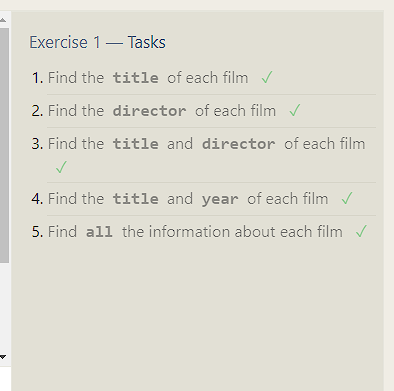
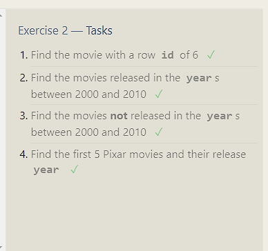
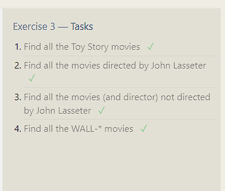
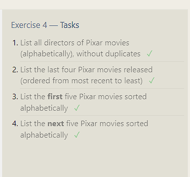

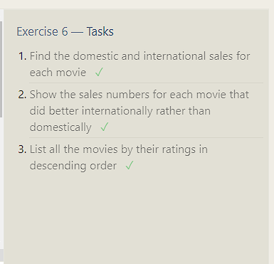
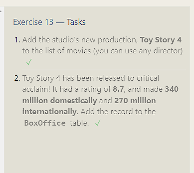
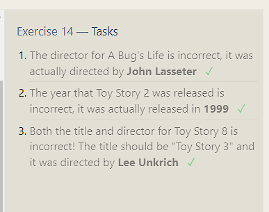
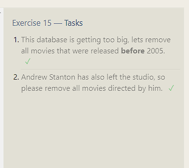
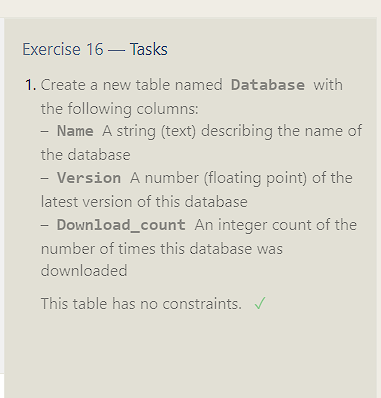
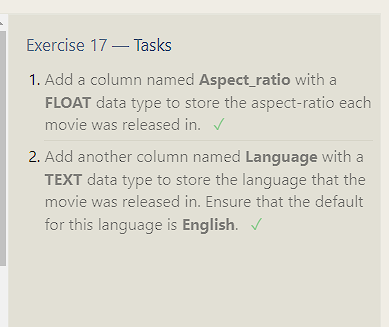
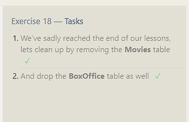